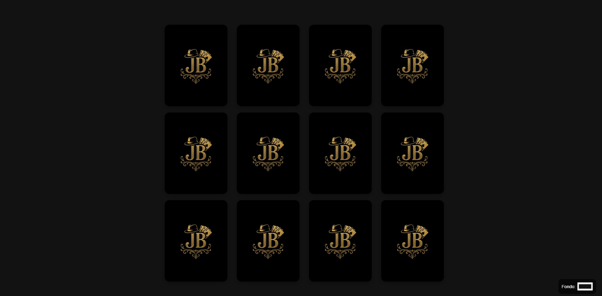

# JB Card Picker

Una pequeña página web de simulación de elección de cartas aleatoria




---

## Descripción

`JB Card Picker` carga una lista de frases o entradas desde el fichero `cartas.txt` y las muestra como un grid de cartas. Al hacer clic en una carta se gira para mostrar su contenido y se abre un modal con la frase elegida y con la opción de aceptar; al aceptar se reproduce una animación de confeti y la carta se vuelve a girar.

El proyecto es ligero (HTML/CSS/JS en un solo fichero .html) y pensado para servirlo con un servidor estático de python.

## Características

- Cartas personalizadas
- Interfaz responsive basada en CSS Grid.
- Efecto 3D de giro para las cartas.
- Animación de confeti en canvas cuando se abre el pop-up.
- Selector de color para cambiar el fondo en tiempo real.

## Requisitos

- Navegador moderno (Chrome, Edge, Firefox, Safari, Opera, Brave, etc.).
- Python instalado para servir la página.

## Instalación y ejecución rápida

1. Clona o descarga este repositorio:

```git
git clone https://github.com/enzitox/jb-card-picker.git
```

2. Navega dentro de la carpeta

```powershell
cd jb-card-picker
```

3. Ejecuta `start.bat` para iniciar la página en local

Para parar la ejecución del programa, con hacer `CTRL + C` te debería pedir confirmación para parar la ejecución del programa por lotes.

## Uso

- Edita `cartas.txt` para añadir, quitar o modificar las cartas (una por línea).
- Al hacer clic en una carta, esta gira. Tras un breve retardo se abre el pop-up con la carta ampliada.
- Pulsa `Aceptar` en el pop-up para cerrar y detener el confeti.
- Cambia el color de fondo con el selector de color flotante.

## Estructura del proyecto

- `jb_cartas.html` — Página web principal con HTML, CSS Y JS incorporados.
- `cartas.txt` — Contenido de las cartas (una carta por línea).
- `start.bat` — Archivo por lotes para iniciar el servidor python y abrir la página en tu navegador.